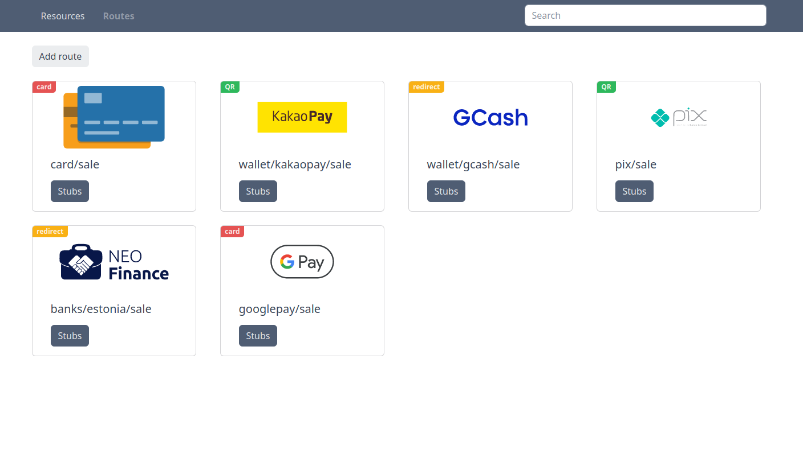

## Description
Payment page mock application



## Run for develop

* Clone this repository
* Copy and adjust environment `cp .env.example .env`
* Run `docker-compose up -d` in project root directory

SPA will be available at:
http://localhost:8083

API will be available at:
http://localhost:8082

Run tests:
```bash
make utils_test
```
