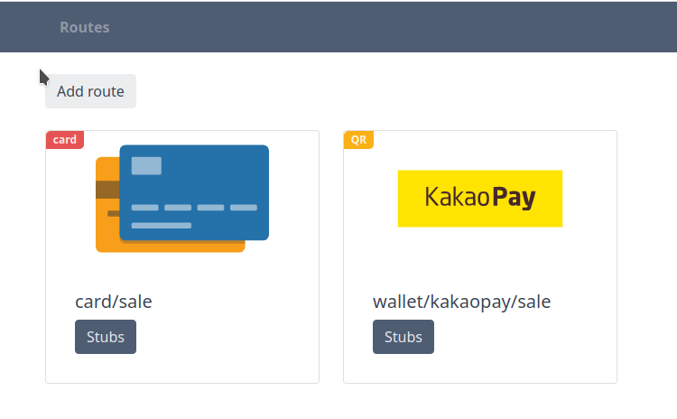

## Description
Payment page mock application



## Run for develop

* Clone this repository
* Run `docker-compose up -d` in project root directory

SPA will be available at:
http://localhost:8083

API will be available at:
http://localhost:8082

Run tests:
```bash
make test
```

Extract example database and uploaded images:
```bash
make example
```

## Run for production
Fetch Docker Swarm definition and Makefile.
```bash
curl -s https://raw.githubusercontent.com/gfsx0259/payment-page-mock/main/Makefile
curl -s https://raw.githubusercontent.com/gfsx0259/payment-page-mock/main/docker-compose.prod.yml
```

Deploy the stack to the Docker Swarm:
```bash
sudo docker stack deploy -c docker-compose.prod.yml dummy
```
